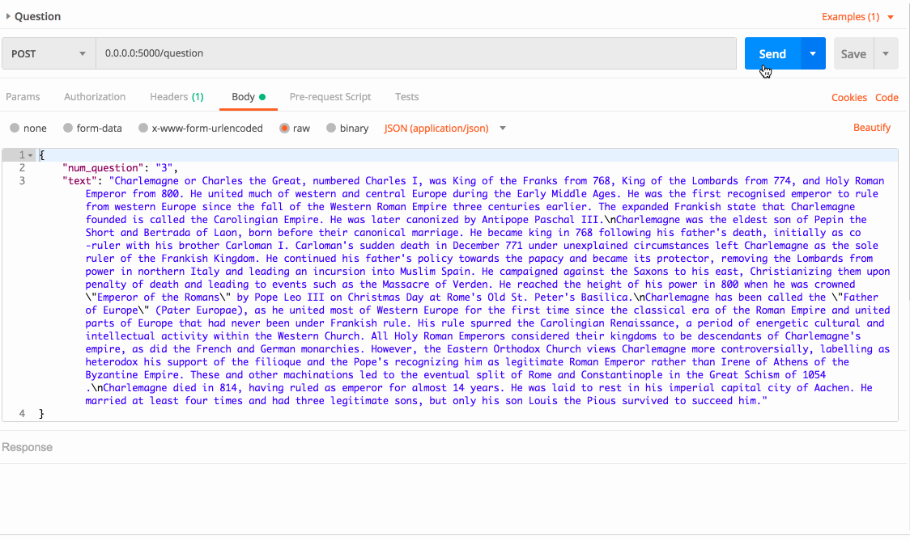

# Learning Lightnr 

This project is a re-implementation of [Gapster](https://github.com/exchez/gapster).  
Generate multiple choice fill-in-the-blank questions from any article.   

 

The name of this project is a pun with lightner/Leitner. The [Leitner system](https://en.wikipedia.org/wiki/Leitner_system) is a spaced repetition learning method.

The semantic role labeller (srl) has been changed from a senna wrapper to the [allennlp Pytorch model](https://allennlp.org/models).  
Some code is re-written to be compatible with spacy v2. 

## Getting Started
You can perform an installation in a python virtual env or with the dockerfile.
### Virutal env installation

#### Setup
**Requires**: python 3.6
 
In the project folder, run the following:

    pip install pandas
    pip install nltk
    pip install spacy
    pip install sumy
    pip install beautifulsoup4
    RUN pip install flask
    pip install gunicorn
    pip install allennlp
    pip install scikit-learn==0.19.0
    python -m spacy download en_core_web_sm
    python -m spacy download en_core_web_md
    python -c "import nltk; nltk.download('stopwords'); nltk.download('averaged_perceptron_tagger'); nltk.download('wordnet'); nltk.download('punkt')"

    wget https://s3-us-west-2.amazonaws.com/allennlp/models/srl-model-2018.05.25.tar.gz
    mv srl-model-2018.05.25.tar.gz app/allen_predictor/srl-model-2018.05.25.tar.gz
    
#### Run the server
To test the serving: 
    
    python app/app.py
    
Or to run a decent server: 
    
    cd app
    gunicorn -w 2 app:app --limit-request-line 20000 -b '0.0.0.0:5000' --timeout 100
    
You can then [try a call](#try-the-api)

### Docker installation
#### Setup
In the project folder, run the following: 

    wget https://s3-us-west-2.amazonaws.com/allennlp/models/srl-model-2018.05.25.tar.gz
    mv srl-model-2018.05.25.tar.gz app/allen_predictor/srl-model-2018.05.25.tar.gz
    docker build -t learninglightnr:latest .
    
#### Run the server
Run the docker image:

    docker run  -d -p 5000:5000 learninglightnr
    
You can then [try a call](#try-the-api)

### Try the API
To try the API, run in a terminal :

    curl -X POST \
    http://0.0.0.0:5000/question \
    -H 'Content-Type: application/json' \
    -d '{
	"num_question": "3",
	"text": "Charlemagne or Charles the Great, numbered Charles I, was King of the Franks from 768, King of the Lombards from 774, and Holy Roman Emperor from 800. He united much of western and central Europe during the Early Middle Ages. He was the first recognised emperor to rule from western Europe since the fall of the Western Roman Empire three centuries earlier. The expanded Frankish state that Charlemagne founded is called the Carolingian Empire. He was later canonized by Antipope Paschal III.\nCharlemagne was the eldest son of Pepin the Short and Bertrada of Laon, born before their canonical marriage. He became king in 768 following his father'\''s death, initially as co-ruler with his brother Carloman I. Carloman'\''s sudden death in December 771 under unexplained circumstances left Charlemagne as the sole ruler of the Frankish Kingdom. He continued his father'\''s policy towards the papacy and became its protector, removing the Lombards from power in northern Italy and leading an incursion into Muslim Spain. He campaigned against the Saxons to his east, Christianizing them upon penalty of death and leading to events such as the Massacre of Verden. He reached the height of his power in 800 when he was crowned \"Emperor of the Romans\" by Pope Leo III on Christmas Day at Rome'\''s Old St. Peter'\''s Basilica.\nCharlemagne has been called the \"Father of Europe\" (Pater Europae), as he united most of Western Europe for the first time since the classical era of the Roman Empire and united parts of Europe that had never been under Frankish rule. His rule spurred the Carolingian Renaissance, a period of energetic cultural and intellectual activity within the Western Church. All Holy Roman Emperors considered their kingdoms to be descendants of Charlemagne'\''s empire, as did the French and German monarchies. However, the Eastern Orthodox Church views Charlemagne more controversially, labelling as heterodox his support of the filioque and the Pope'\''s recognizing him as legitimate Roman Emperor rather than Irene of Athens of the Byzantine Empire. These and other machinations led to the eventual split of Rome and Constantinople in the Great Schism of 1054.\nCharlemagne died in 814, having ruled as emperor for almost 14 years. He was laid to rest in his imperial capital city of Aachen. He married at least four times and had three legitimate sons, but only his son Louis the Pious survived to succeed him."
    }'
    
You should get the following output:
    
    {
        "question0": {
            "answer": "the byzantine empire",
            "distractors": [
                "the kingdom",
                "the short",
                "the western church"
            ],
            "question": "However, the Eastern Orthodox Church views Charlemagne more controversially, labelling as heterodox his support of the filioque and the Pope's recognizing him as legitimate Roman Emperor rather than Irene of Athens of ___________ _."
        },
        "question1": {
            "answer": "muslim spain",
            "distractors": [
                "athens",
                "constantinople",
                "rome"
            ],
            "question": "He continued his father's policy towards the papacy and became its protector, removing the Lombards from power in northern Italy and leading an incursion into ___________ _."
        },
        "question2": {
            "answer": "rome",
            "distractors": [
                "italy",
                "charlemagne",
                "roman empire"
            ],
            "question": "He reached the height of his power in 800 when he was crowned \"Emperor of the Romans\" by Pope Leo III on Christmas Day at ___________'s Old St. Peter's Basilica."
        }
    }

Enjoy experimenting with other 

## Nota Bene
- This is a really quick re-implementation I made in a few minutes. A lot of shorcut were taken.
- This project was for demo purpose. I don't plan to work on it again before mid 2019.
- The best question predictor model was not retrained, I kept [exchez](https://github.com/exchez)'s one. 
- The AllenNLP srl output is parsed into senna output format to avoid rewriting some code.
- I dropped the original demo front-end
- The pywsd package in this repository is patched to fix a bug that would prevent the semantic disambiguation to work correctly. This fix has not been accepted yet in the official pywsd package.

## Next Steps
- remove ascci sentence values that were required by senna but not by allennlp srl predictor
- re train the model based on the MS dataset and rewrite cleanly the allen srl integration
- create a demo front end like in gapster
- propose different summing up functions
- hope pywsd pull request wil be accepted, then remove custom patched pywsd from sources
- make the nltk resources downoad cleaner
- analyse behaviour of the summing up with medium articles

